# Testing

> [!NOTE]
> Return back to the [README.md](README.md) file.

This document records manual and automated validation carried out on the deployed application and the local test environment.

Testing focus areas:

- Core e-commerce flow (cart, checkout, payment state updates, order history)
- Access control (guest vs authenticated vs superuser behavior)
- SEO endpoints (robots and sitemap)
- Form validation and defensive behavior

## Code Validation

Validation was completed for project-owned code only (not third-party/vendor assets). Screenshots are referenced in the tables below.

### HTML

⚠️ INSTRUCTIONS ⚠️

1. [*recommended*] If you are using the live deployed site URLs, validate using this link: https://validator.w3.org/#validate_by_uri
2. Otherwise, if you are copying/pasting your HTML code manually, use this link: https://validator.w3.org/#validate_by_input

It's recommended to validate the live pages (all of them) using the deployed URL. This will give you a custom URL as well, which you can use below on your testing documentation. It makes it easier to return back to a page for validating it again in the future. The URL will look something like this:

- https://validator.w3.org/nu/?doc=https://KC-85.github.io/Modern-Classics/index.html

⚠️ --- END --- ⚠️

🛑 IMPORTANT 🛑

RE: Python/Jinja syntax in HTML

Python projects that use Jinja syntax, such as ``, ``, and `{{ variable|filter }}` will not validate properly if you're copying/pasting into the HTML validator.

In order to properly validate these types of files, it's recommended to [validate by uri](https://validator.w3.org/#validate_by_uri) from the deployed Heroku pages.

Unfortunately, pages that require a user to be "logged-in" and authenticated (CRUD functionality) will not work using this method, due to the fact that the HTML Validator (W3C) doesn't have access to login to an account on your project. In order to properly validate HTML pages with Jinja syntax for authenticated pages, follow these steps:

- Navigate to the deployed pages which require authentication.
- Right-click anywhere on the page, and select **View Page Source** (usually `CTRL+U` or `⌘+U` on Mac).
- This will display the entire "compiled" code, without any Jinja syntax.
- Copy everything, and use the [validate by input](https://validator.w3.org/#validate_by_input) method.
- Repeat this process for every page that requires a user to be logged-in/authenticated (e.g.: CRUD functionality).

🛑 ---- END --- 🛑

I have used the recommended [HTML W3C Validator](https://validator.w3.org) to validate all of my HTML files.


### CSS

⚠️ INSTRUCTIONS ⚠️

1. [*recommended*] If you are using the live deployed site, use this link: https://jigsaw.w3.org/css-validator/#validate_by_uri
2. If you are copying/pasting your CSS code, use this link: https://jigsaw.w3.org/css-validator/#validate_by_input

It's recommended to validate the live site for your primary CSS file on the deployed URL. This will give you a custom URL as well, which you can use below on your testing documentation. It makes it easier to return back to a page for validating it again in the future. The URL will look something like this:

- https://jigsaw.w3.org/css-validator/validator?uri=https://modern-classics-b10468fd6f55.herokuapp.com

If you have additional/multiple CSS files, then individual "[validation by input](https://jigsaw.w3.org/css-validator/#validate_by_input)" is recommended for the extra CSS files.

**IMPORTANT**: Third-Party tools

If you're using external libraries/frameworks (e.g: Bootstrap, Materialize, Font Awesome, etc.), then sometimes the tool will attempt to also validate these, even though it's not part of your own actual code that you wrote. You are not required to validate the external libraries or frameworks!

⚠️ --- END --- ⚠️

I have used the recommended [CSS Jigsaw Validator](https://jigsaw.w3.org/css-validator) to validate all of my CSS files.

| Directory | File | URL | Screenshot | Notes |
| --- | --- | --- | --- | --- |
| static | [hero.css](https://github.com/KC-85/Modern-Classics/blob/main/static/css/components/hero.css) | Link (if applicable) | 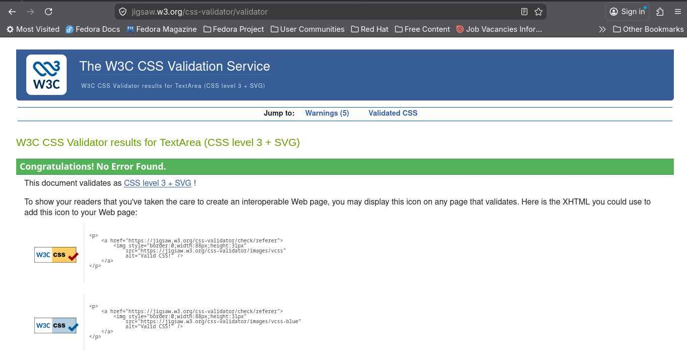 | Notes (if applicable) |
| static | [main.css](https://github.com/KC-85/Modern-Classics/blob/main/static/css/main.css) | Link (if applicable) |  | Notes (if applicable) |
| static | [checkout.css](https://github.com/KC-85/Modern-Classics/blob/main/static/css/pages/checkout.css) | Link (if applicable) |  | Notes (if applicable) |
| static | [showroom.css](https://github.com/KC-85/Modern-Classics/blob/main/static/css/pages/showroom.css) | Link (if applicable) |  | Notes (if applicable) |


### JavaScript

⚠️ INSTRUCTIONS ⚠️

If using modern JavaScript (ES6) methods, then make sure to include the following line at the very top of every single JavaScript file in your project (this should remain in your files for submission as well):

`/* jshint esversion: 11 */`

If you are also including jQuery (`$`), then the updated format will be:

`/* jshint esversion: 11, jquery: true */`

This allows the JShint validator to recognize modern ES6 methods, such as: `let`, `const`, `template literals`, `arrow functions (=>)`, etc.

**IMPORTANT**: External resources

Sometimes we'll write JavaScript that imports variables from other files, such as "an array of questions" from `questions.js`, which are used within the main `script.js` file elsewhere. If that's the case, the JShint validation tool doesn't know how to recognize "unused variables" that would normally be imported locally when running your own project. These warnings are acceptable, so showcase on your screenshot(s).

The same thing applies when using external libraries such as Stripe, Leaflet, Bootstrap, Materialize, etc. To instantiate these components, we need to use their respective declarator. Again, the JShint validation tool would flag these as "undefined/unused variables". These warnings are acceptable, so showcase on your screenshot(s).

⚠️ --- END --- ⚠️

I have used the recommended [JShint Validator](https://jshint.com) to validate all of my JS files.

| Directory | File | URL | Screenshot | Notes |
| --- | --- | --- | --- | --- |
|  | [babel.config.js](https://github.com/KC-85/Modern-Classics/blob/main/babel.config.js) |  |  | ⚠️ Notes (if applicable) |
|  | [jest.config.js](https://github.com/KC-85/Modern-Classics/blob/main/jest.config.js) |  |  | ⚠️ Notes (if applicable) |
| static | [cartBadge.js](https://github.com/KC-85/Modern-Classics/blob/main/static/js/components/cartBadge.js) |  | 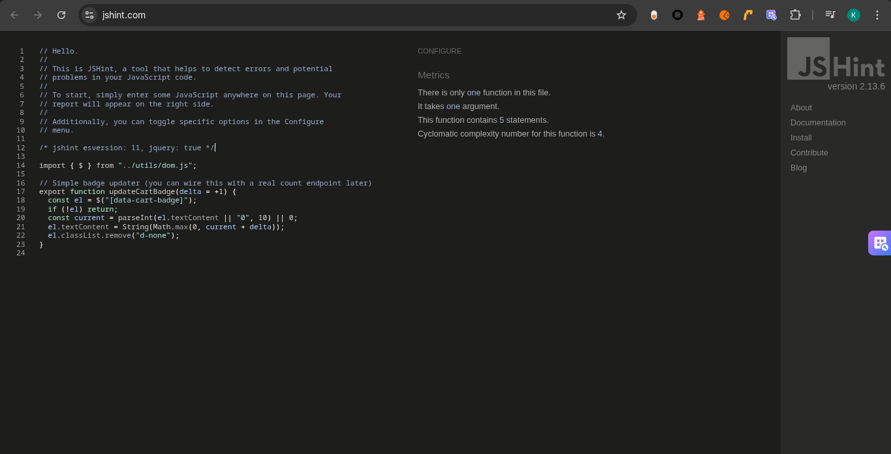 | ⚠️ Notes (if applicable) |
| static | [main.js](https://github.com/KC-85/Modern-Classics/blob/main/static/js/main.js) |  | 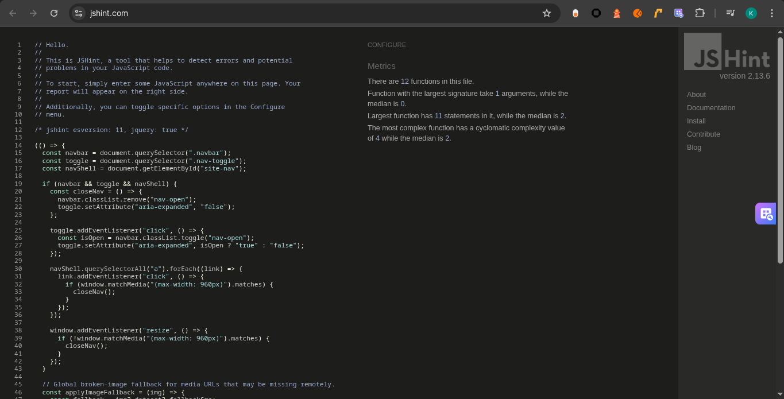 | ⚠️ Notes (if applicable) |
| static | [carDetail.js](https://github.com/KC-85/Modern-Classics/blob/main/static/js/pages/carDetail.js) |  | 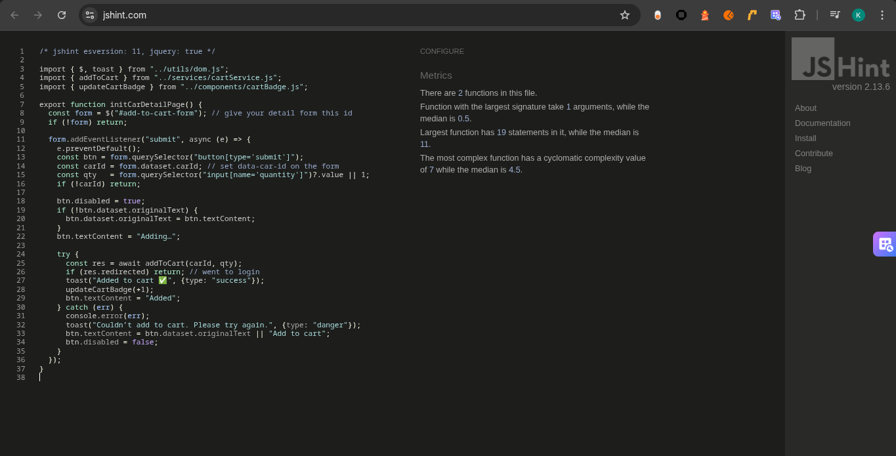 | ⚠️ Notes (if applicable) |
| static | [hero.js](https://github.com/KC-85/Modern-Classics/blob/main/static/js/pages/hero.js) |  | 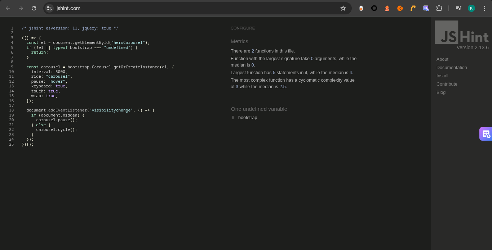 | ⚠️ Notes (if applicable) |
| static | [showroom.js](https://github.com/KC-85/Modern-Classics/blob/main/static/js/pages/showroom.js) |  | 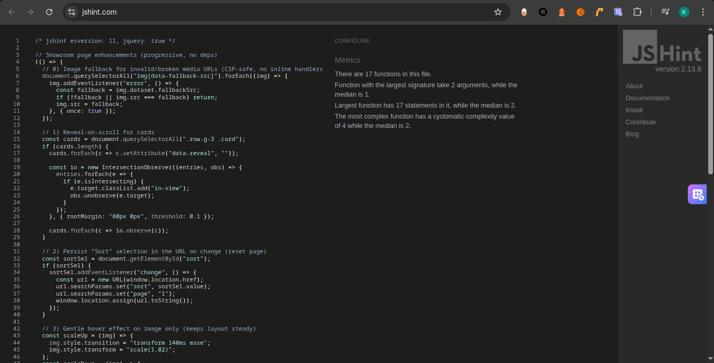 | ⚠️ Notes (if applicable) |
| static | [cartService.js](https://github.com/KC-85/Modern-Classics/blob/main/static/js/services/cartService.js) |  | 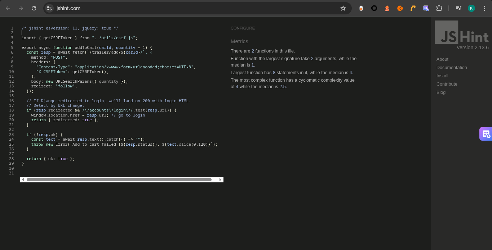 | ⚠️ Notes (if applicable) |
| static | [csrf.js](https://github.com/KC-85/Modern-Classics/blob/main/static/js/utils/csrf.js) |  | 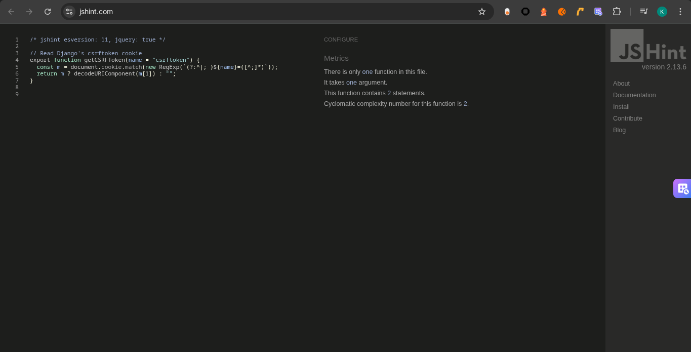 | ⚠️ Notes (if applicable) |
| static | [dom.js](https://github.com/KC-85/Modern-Classics/blob/main/static/js/utils/dom.js) |  | 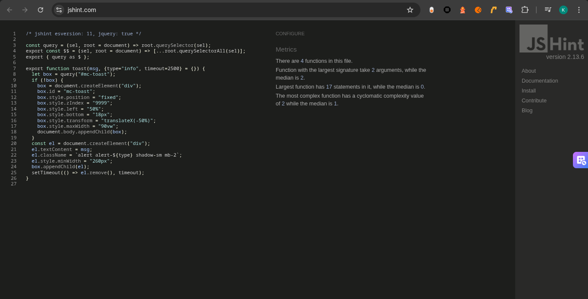 | ⚠️ Notes (if applicable) |
| static | [cardetail.test.js](https://github.com/KC-85/Modern-Classics/blob/main/static/js_tests/cardetail.test.js) |  | 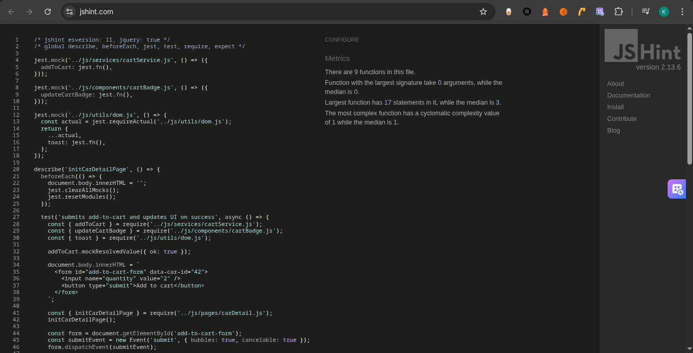 | ⚠️ Notes (if applicable) |
| static | [cartbadge.test.js](https://github.com/KC-85/Modern-Classics/blob/main/static/js_tests/cartbadge.test.js) |  | 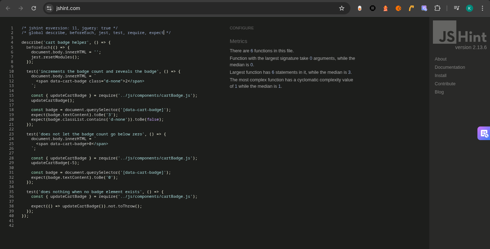 | ⚠️ Notes (if applicable) |
| static | [cartservice.test.js](https://github.com/KC-85/Modern-Classics/blob/main/static/js_tests/cartservice.test.js) |  | 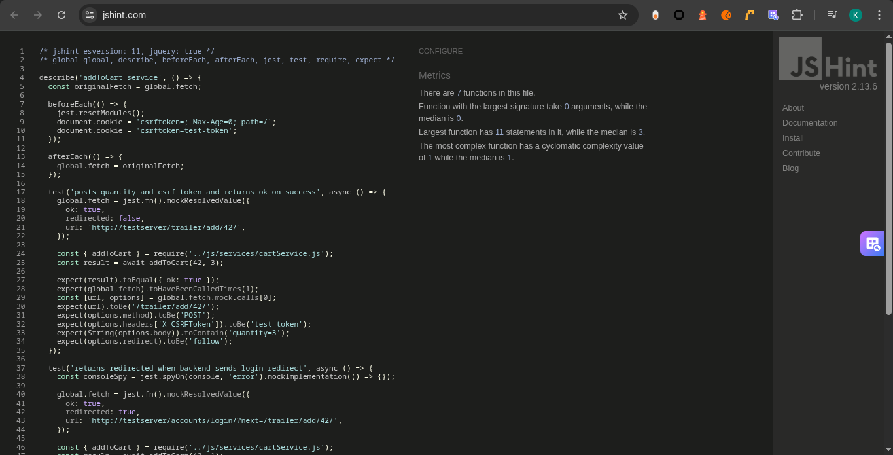 | ⚠️ Notes (if applicable) |
| static | [csrf.test.js](https://github.com/KC-85/Modern-Classics/blob/main/static/js_tests/csrf.test.js) |  | 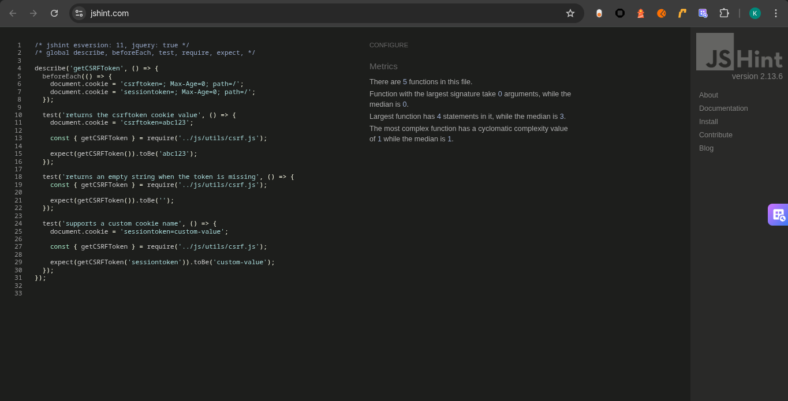 | ⚠️ Notes (if applicable) |
| static | [dom.test.js](https://github.com/KC-85/Modern-Classics/blob/main/static/js_tests/dom.test.js) |  | 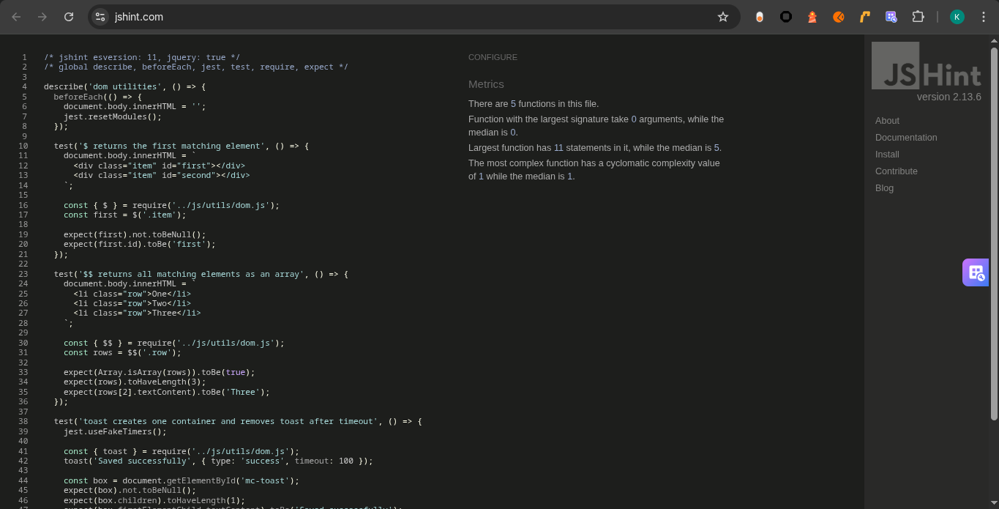 | ⚠️ Notes (if applicable) |
| static | [hero.test.js](https://github.com/KC-85/Modern-Classics/blob/main/static/js_tests/hero.test.js) |  | 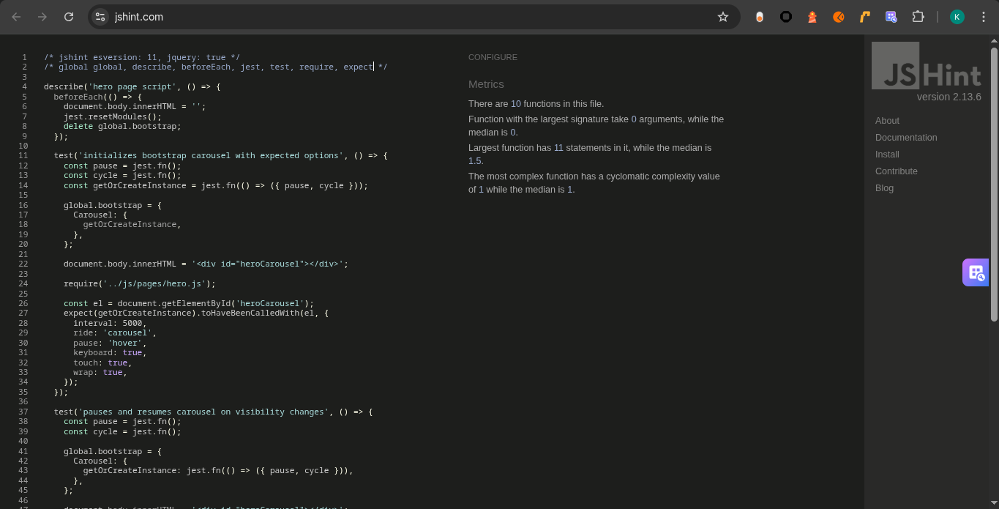 | ⚠️ Notes (if applicable) |
| static | [main.test.js](https://github.com/KC-85/Modern-Classics/blob/main/static/js_tests/main.test.js) |  | 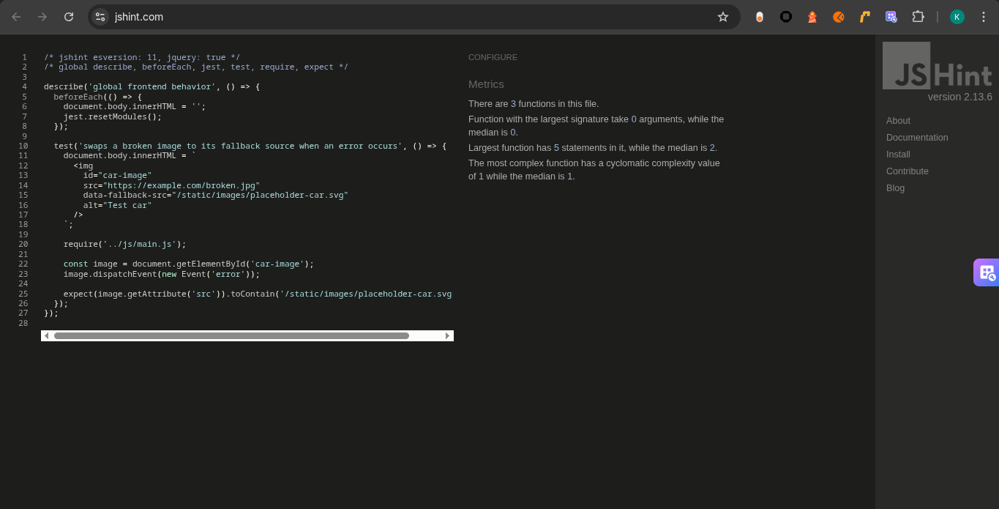 | ⚠️ Notes (if applicable) |
| static | [showroom.test.js](https://github.com/KC-85/Modern-Classics/blob/main/static/js_tests/showroom.test.js) |  | 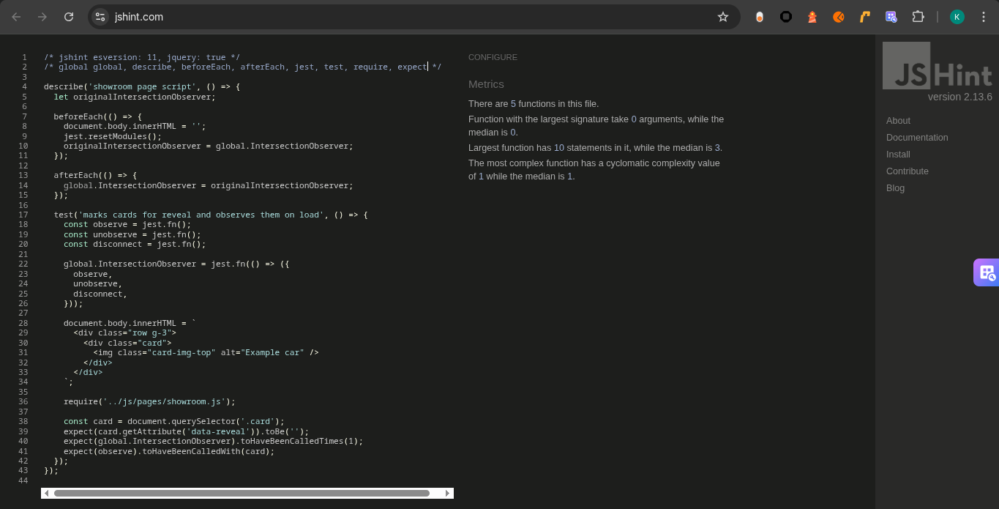 | ⚠️ Notes (if applicable) |


### Python

🛑 IMPORTANT 🛑

**IMPORTANT**: Django settings

The Django `settings.py` file comes with 4 lines that are quite long, and will throw the `E501 line too long` error. This is default behavior, but can be fixed by adding the "`  # noqa`" comment at the end of those lines.

```python
AUTH_PASSWORD_VALIDATORS = [
    {
        "NAME": "django.contrib.auth.password_validation.UserAttributeSimilarityValidator",  # noqa
    },
    {
        "NAME": "django.contrib.auth.password_validation.MinimumLengthValidator",  # noqa
    },
    {
        "NAME": "django.contrib.auth.password_validation.CommonPasswordValidator",  # noqa
    },
    {
        "NAME": "django.contrib.auth.password_validation.NumericPasswordValidator",  # noqa
    },
]
```

**IMPORTANT**: *migration* and *pycache* files

You do not have to validate files from the `migrations/` or `pycache/` folders! Ignore these `.py` files, and validate just the files that you've created or modified.

🛑 --- END --- 🛑

I have used the recommended [PEP8 CI Python Linter](https://pep8ci.herokuapp.com) to validate all of my Python files.

| Directory | File | URL | Screenshot | Notes |
| --- | --- | --- | --- | --- |
| apps | [admin.py](https://github.com/KC-85/Modern-Classics/blob/main/apps/common/admin.py) | [PEP8 CI Link](https://pep8ci.herokuapp.com/https://raw.githubusercontent.com/KC-85/Modern-Classics/main/apps/common/admin.py) | 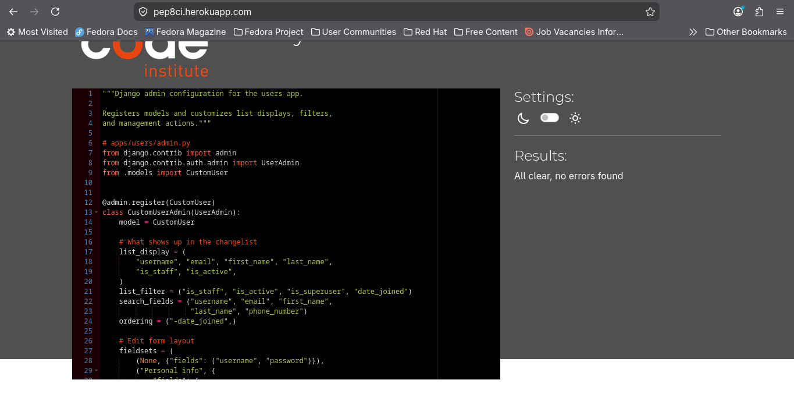 | Notes (if applicable) |
| apps | [forms.py](https://github.com/KC-85/Modern-Classics/blob/main/apps/common/forms.py) | [PEP8 CI Link](https://pep8ci.herokuapp.com/https://raw.githubusercontent.com/KC-85/Modern-Classics/main/apps/common/forms.py) | 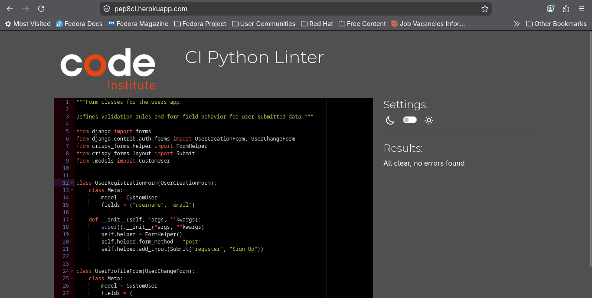 | Notes (if applicable) |
| apps | [models.py](https://github.com/KC-85/Modern-Classics/blob/main/apps/common/models.py) | [PEP8 CI Link](https://pep8ci.herokuapp.com/https://raw.githubusercontent.com/KC-85/Modern-Classics/main/apps/common/models.py) | 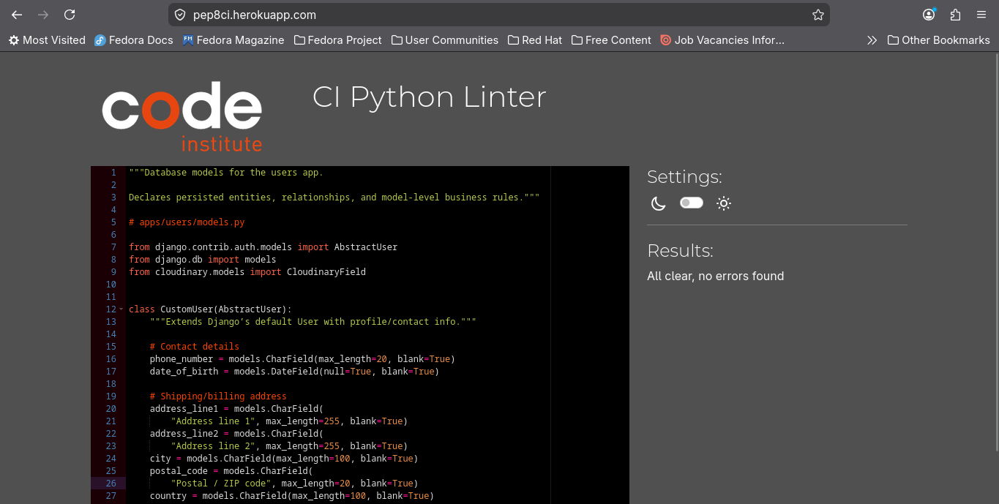 | Notes (if applicable) |
| apps | [urls.py](https://github.com/KC-85/Modern-Classics/blob/main/apps/common/urls.py) | [PEP8 CI Link](https://pep8ci.herokuapp.com/https://raw.githubusercontent.com/KC-85/Modern-Classics/main/apps/common/urls.py) | 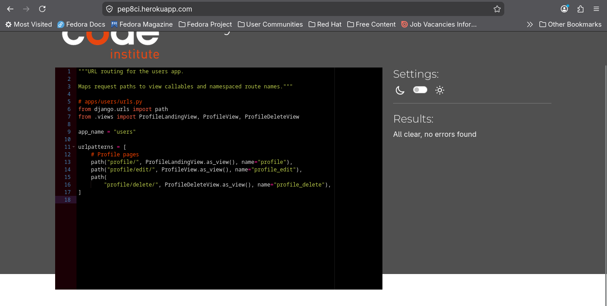 | Notes (if applicable) |
| apps | [views.py](https://github.com/KC-85/Modern-Classics/blob/main/apps/common/views.py) | [PEP8 CI Link](https://pep8ci.herokuapp.com/https://raw.githubusercontent.com/KC-85/Modern-Classics/main/apps/common/views.py) | 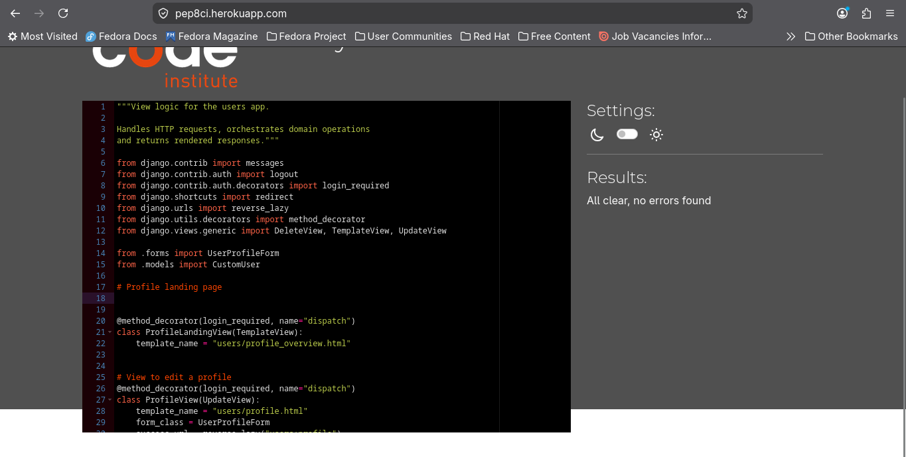 | Notes (if applicable) |
| apps | [admin.py](https://github.com/KC-85/Modern-Classics/blob/main/apps/checkout/admin.py) | [PEP8 CI Link](https://pep8ci.herokuapp.com/https://raw.githubusercontent.com/KC-85/Modern-Classics/main/apps/checkout/admin.py) | 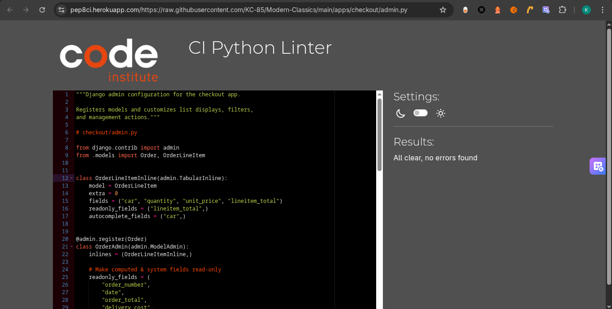 | Notes (if applicable) |
| apps | [forms.py](https://github.com/KC-85/Modern-Classics/blob/main/apps/checkout/forms.py) | [PEP8 CI Link](https://pep8ci.herokuapp.com/https://raw.githubusercontent.com/KC-85/Modern-Classics/main/apps/checkout/forms.py) | 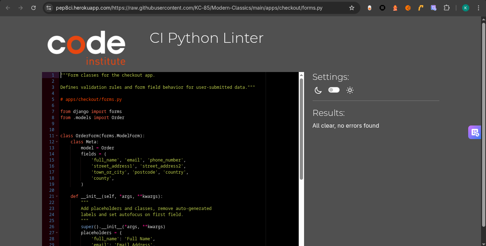 | Notes (if applicable) |
| apps | [models.py](https://github.com/KC-85/Modern-Classics/blob/main/apps/checkout/models.py) | [PEP8 CI Link](https://pep8ci.herokuapp.com/https://raw.githubusercontent.com/KC-85/Modern-Classics/main/apps/checkout/models.py) | 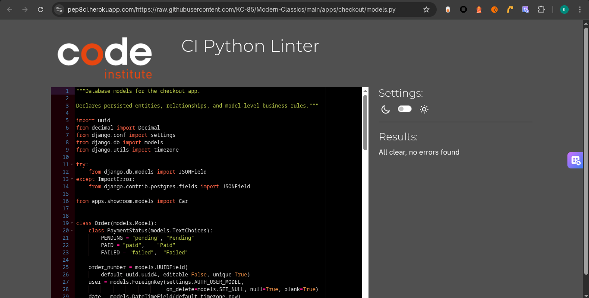 | Notes (if applicable) |
| apps | [urls.py](https://github.com/KC-85/Modern-Classics/blob/main/apps/checkout/urls.py) | [PEP8 CI Link](https://pep8ci.herokuapp.com/https://raw.githubusercontent.com/KC-85/Modern-Classics/main/apps/checkout/urls.py) | 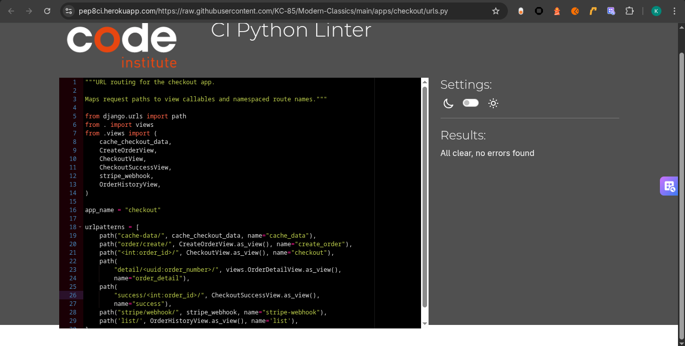 | Notes (if applicable) |
| apps | [views.py](https://github.com/KC-85/Modern-Classics/blob/main/apps/checkout/views.py) | [PEP8 CI Link](https://pep8ci.herokuapp.com/https://raw.githubusercontent.com/KC-85/Modern-Classics/main/apps/checkout/views.py) | 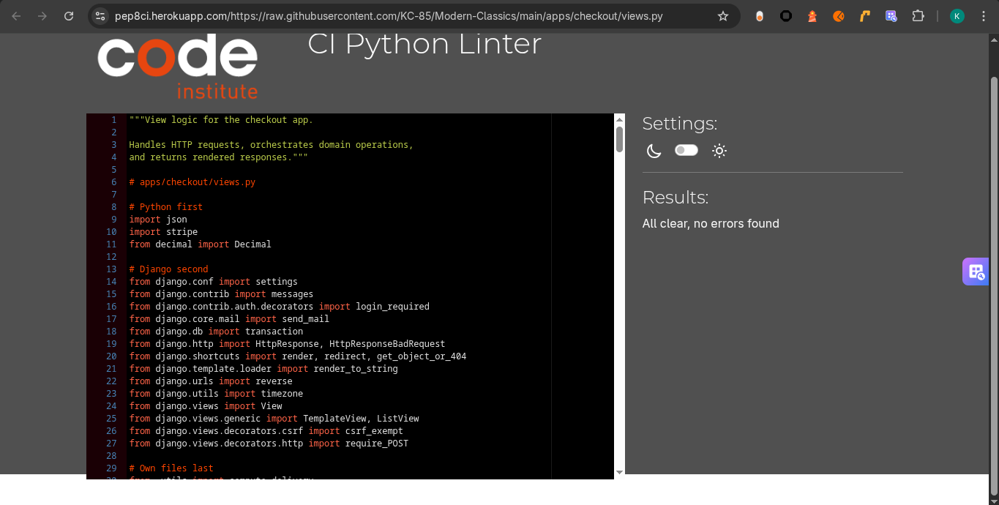 | Notes (if applicable) |
| apps | [utils.py](https://github.com/KC-85/Modern-Classics/blob/main/apps/checkout/utils.py) | [PEP8 CI Link](https://pep8ci.herokuapp.com/https://raw.githubusercontent.com/KC-85/Modern-Classics/main/apps/checkout/utils.py) | 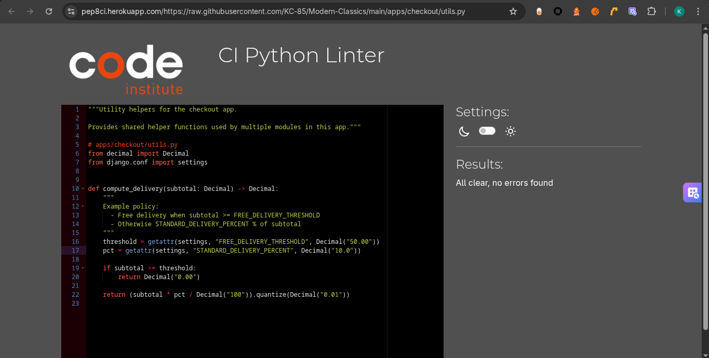 | Notes (if applicable) |
| apps | [webhook_handler.py](https://github.com/KC-85/Modern-Classics/blob/main/apps/checkout/webhook_handler.py) | [PEP8 CI Link](https://pep8ci.herokuapp.com/https://raw.githubusercontent.com/KC-85/Modern-Classics/main/apps/checkout/webhook_handler.py) | 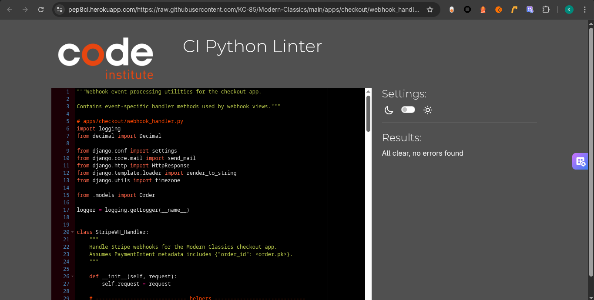 | Notes (if applicable) |
| apps | [webhooks.py](https://github.com/KC-85/Modern-Classics/blob/main/apps/checkout/webhooks.py) | [PEP8 CI Link](https://pep8ci.herokuapp.com/https://raw.githubusercontent.com/KC-85/Modern-Classics/main/apps/checkout/webhooks.py) | 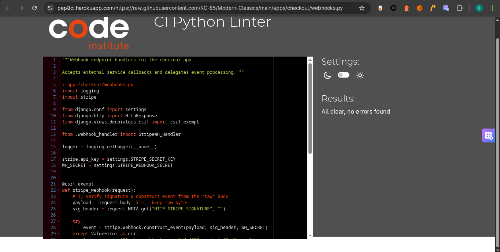 | Notes (if applicable) |
| apps | [admin.py](https://github.com/KC-85/Modern-Classics/blob/main/apps/common/admin.py) | [PEP8 CI Link](https://pep8ci.herokuapp.com/https://raw.githubusercontent.com/KC-85/Modern-Classics/main/apps/common/admin.py) | 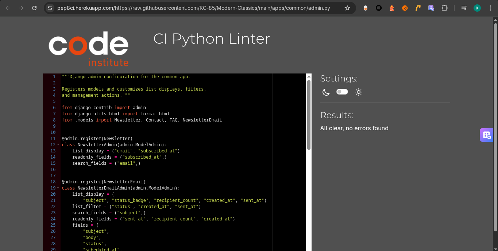 | Notes (if applicable) |
| apps | [forms.py](https://github.com/KC-85/Modern-Classics/blob/main/apps/common/forms.py) | [PEP8 CI Link](https://pep8ci.herokuapp.com/https://raw.githubusercontent.com/KC-85/Modern-Classics/main/apps/common/forms.py) | 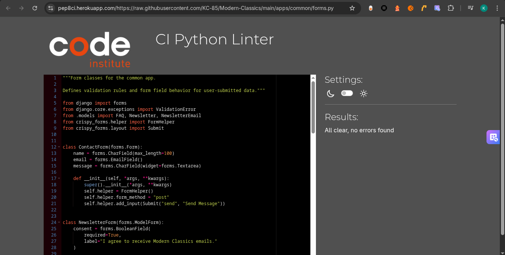 | Notes (if applicable) |
| apps | [models.py](https://github.com/KC-85/Modern-Classics/blob/main/apps/common/models.py) | [PEP8 CI Link](https://pep8ci.herokuapp.com/https://raw.githubusercontent.com/KC-85/Modern-Classics/main/apps/common/models.py) | 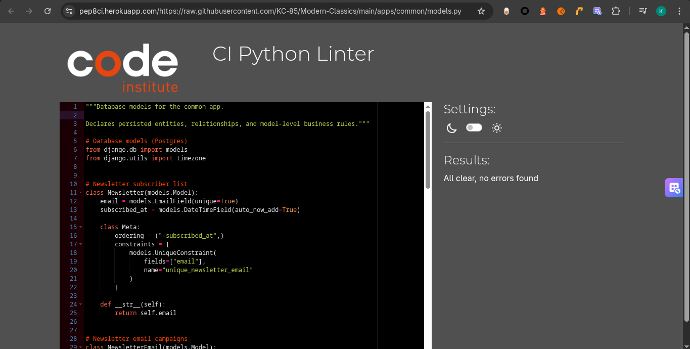 | Notes (if applicable) |
| apps | [urls.py](https://github.com/KC-85/Modern-Classics/blob/main/apps/common/urls.py) | [PEP8 CI Link](https://pep8ci.herokuapp.com/https://raw.githubusercontent.com/KC-85/Modern-Classics/main/apps/common/urls.py) | 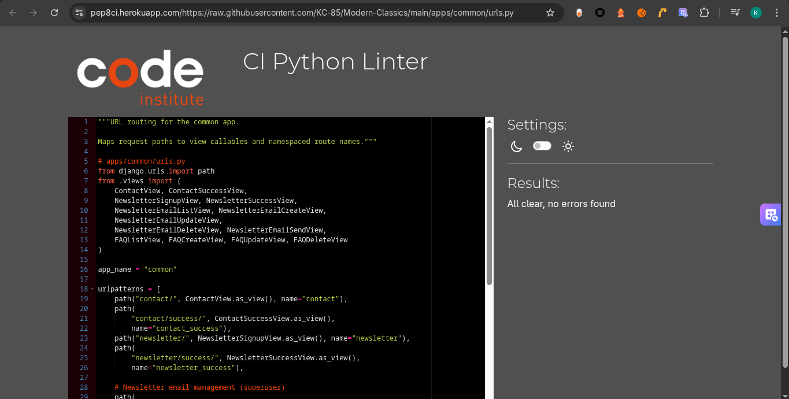 | Notes (if applicable) |
| apps | [views.py](https://github.com/KC-85/Modern-Classics/blob/main/apps/common/views.py) | [PEP8 CI Link](https://pep8ci.herokuapp.com/https://raw.githubusercontent.com/KC-85/Modern-Classics/main/apps/common/views.py) | 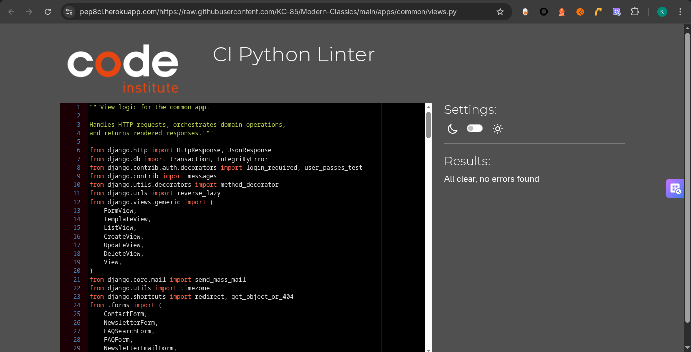 | Notes (if applicable) |
| apps | [auth_mixins.py](https://github.com/KC-85/Modern-Classics/blob/main/apps/common/auth_mixins.py) | [PEP8 CI Link](https://pep8ci.herokuapp.com/https://raw.githubusercontent.com/KC-85/Modern-Classics/main/apps/common/auth_mixins.py) | 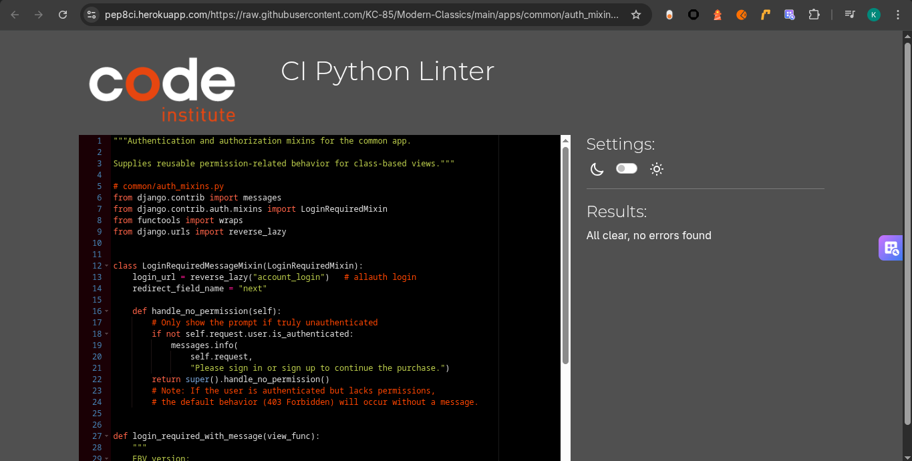 | Notes (if applicable) |
| apps | [admin.py](https://github.com/KC-85/Modern-Classics/blob/main/apps/showroom/admin.py) | [PEP8 CI Link](https://pep8ci.herokuapp.com/https://raw.githubusercontent.com/KC-85/Modern-Classics/main/apps/showroom/admin.py) | 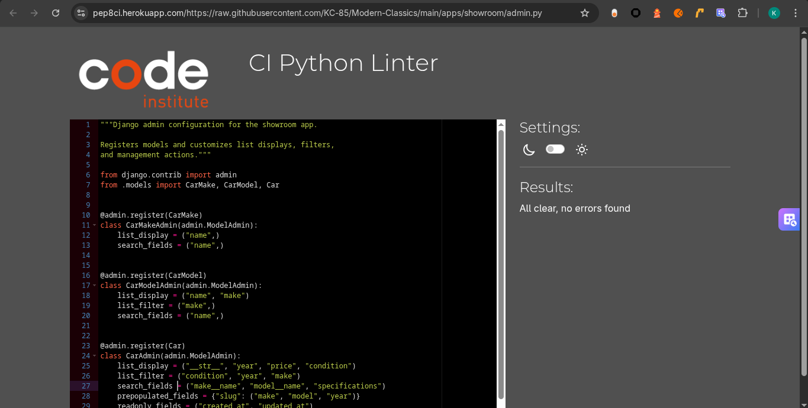 | Notes (if applicable) |
| apps | [forms.py](https://github.com/KC-85/Modern-Classics/blob/main/apps/showroom/forms.py) | [PEP8 CI Link](https://pep8ci.herokuapp.com/https://raw.githubusercontent.com/KC-85/Modern-Classics/main/apps/showroom/forms.py) | 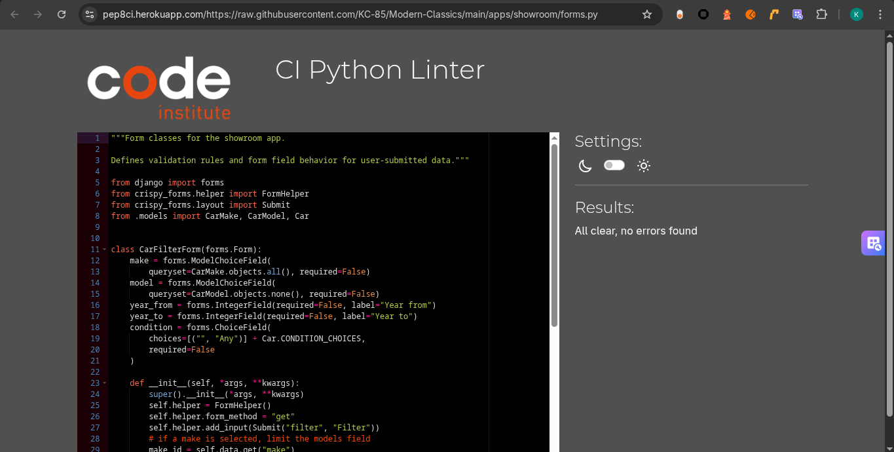 | Notes (if applicable) |
| apps | [models.py](https://github.com/KC-85/Modern-Classics/blob/main/apps/showroom/models.py) | [PEP8 CI Link](https://pep8ci.herokuapp.com/https://raw.githubusercontent.com/KC-85/Modern-Classics/main/apps/showroom/models.py) | 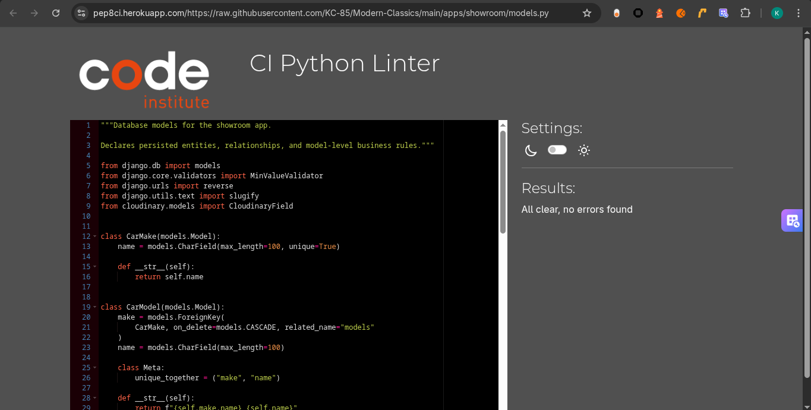 | Notes (if applicable) |
| apps | [urls.py](https://github.com/KC-85/Modern-Classics/blob/main/apps/showroom/urls.py) | [PEP8 CI Link](https://pep8ci.herokuapp.com/https://raw.githubusercontent.com/KC-85/Modern-Classics/main/apps/showroom/urls.py) | 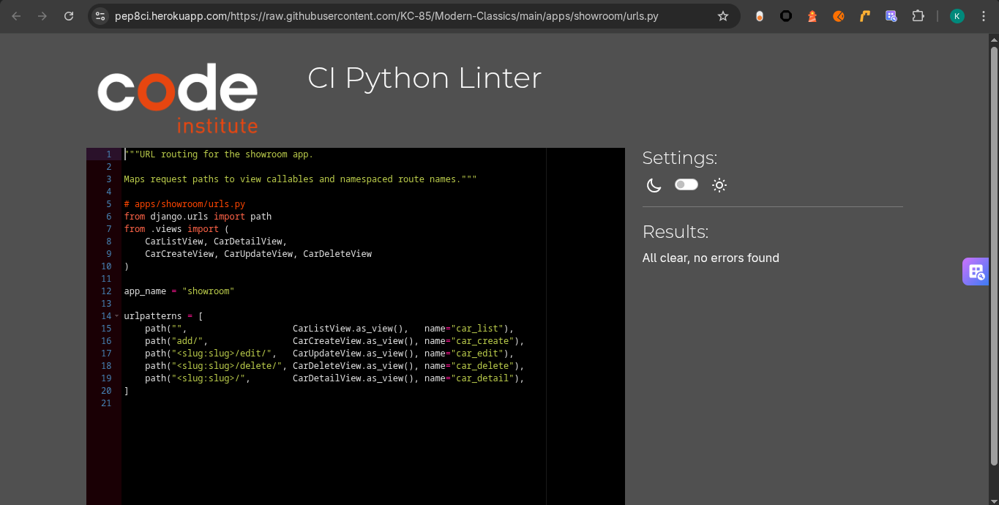 | Notes (if applicable) |
| apps | [views.py](https://github.com/KC-85/Modern-Classics/blob/main/apps/showroom/views.py) | [PEP8 CI Link](https://pep8ci.herokuapp.com/https://raw.githubusercontent.com/KC-85/Modern-Classics/main/apps/showroom/views.py) | 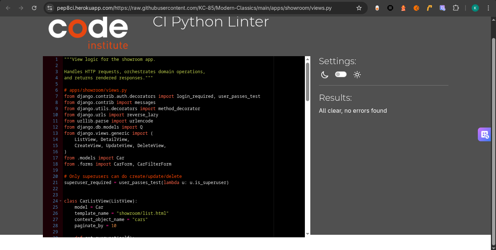 | Notes (if applicable) |
| apps | [admin.py](https://github.com/KC-85/Modern-Classics/blob/main/apps/trailer/admin.py) | [PEP8 CI Link](https://pep8ci.herokuapp.com/https://raw.githubusercontent.com/KC-85/Modern-Classics/main/apps/trailer/admin.py) | 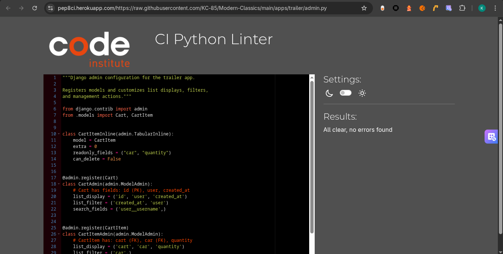 | Notes (if applicable) |
| apps | [forms.py](https://github.com/KC-85/Modern-Classics/blob/main/apps/trailer/forms.py) | [PEP8 CI Link](https://pep8ci.herokuapp.com/https://raw.githubusercontent.com/KC-85/Modern-Classics/main/apps/trailer/forms.py) | 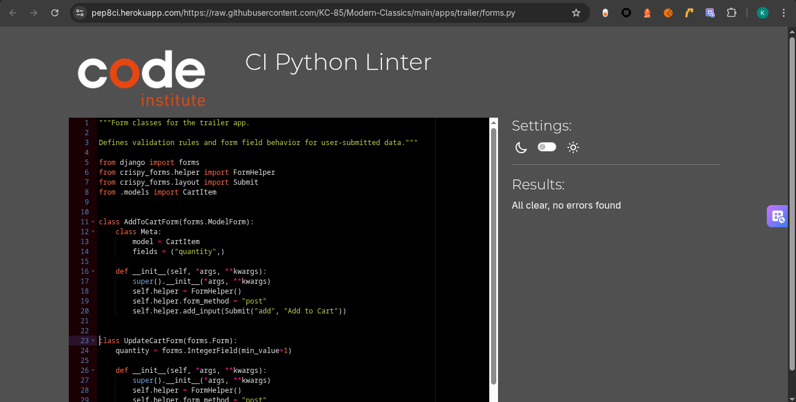 | Notes (if applicable) |
| apps | [models.py](https://github.com/KC-85/Modern-Classics/blob/main/apps/trailer/models.py) | [PEP8 CI Link](https://pep8ci.herokuapp.com/https://raw.githubusercontent.com/KC-85/Modern-Classics/main/apps/trailer/models.py) | 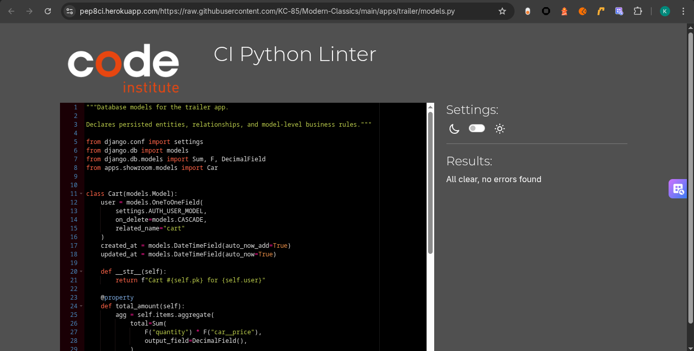 | Notes (if applicable) |
| apps | [urls.py](https://github.com/KC-85/Modern-Classics/blob/main/apps/trailer/urls.py) | [PEP8 CI Link](https://pep8ci.herokuapp.com/https://raw.githubusercontent.com/KC-85/Modern-Classics/main/apps/trailer/urls.py) | 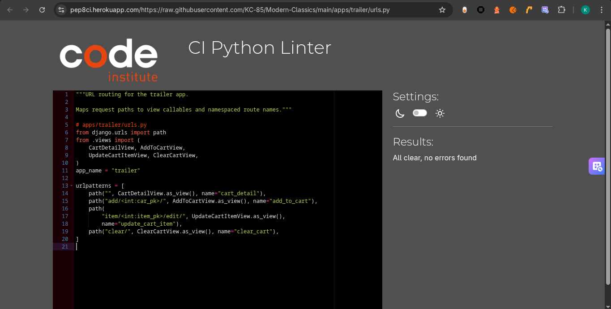 | Notes (if applicable) |
| apps | [views.py](https://github.com/KC-85/Modern-Classics/blob/main/apps/trailer/views.py) | [PEP8 CI Link](https://pep8ci.herokuapp.com/https://raw.githubusercontent.com/KC-85/Modern-Classics/main/apps/trailer/views.py) | 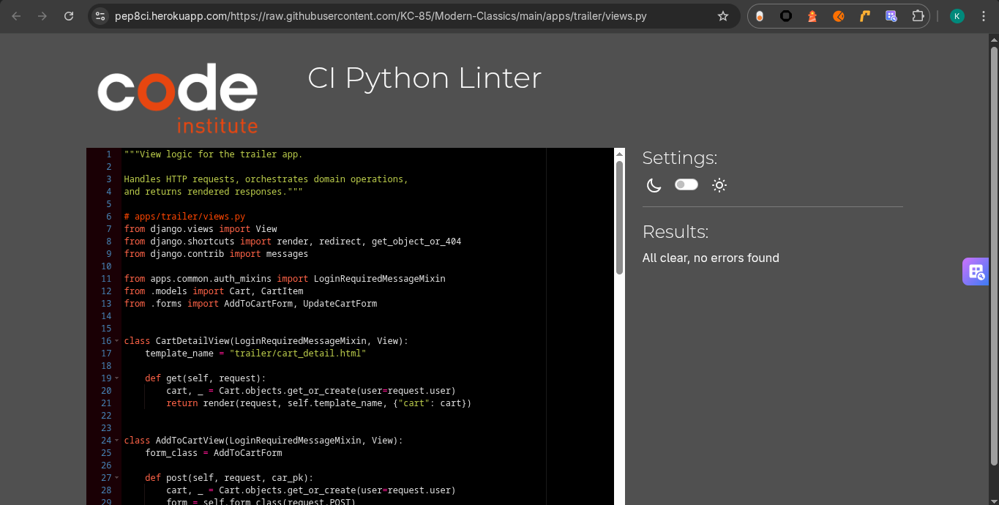 | Notes (if applicable) |
| apps | [admin.py](https://github.com/KC-85/Modern-Classics/blob/main/apps/delivery/admin.py) | [PEP8 CI Link](https://pep8ci.herokuapp.com/https://raw.githubusercontent.com/KC-85/Modern-Classics/main/apps/delivery/admin.py) | 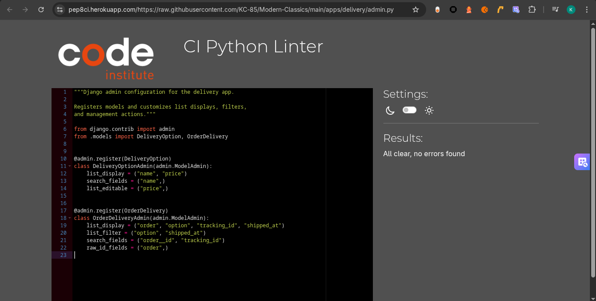 | Notes (if applicable) |
| apps | [forms.py](https://github.com/KC-85/Modern-Classics/blob/main/apps/delivery/forms.py) | [PEP8 CI Link](https://pep8ci.herokuapp.com/https://raw.githubusercontent.com/KC-85/Modern-Classics/main/apps/delivery/forms.py) | 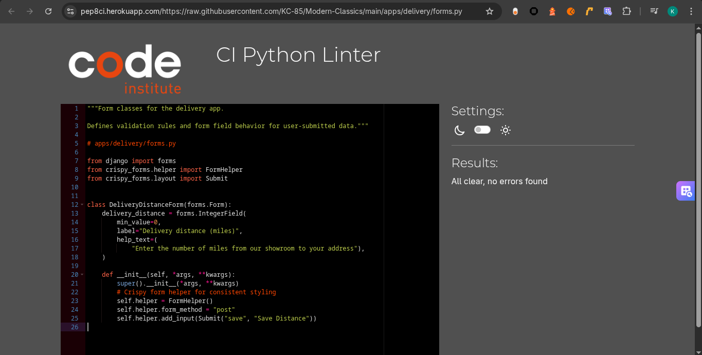 | Notes (if applicable) |
| apps | [models.py](https://github.com/KC-85/Modern-Classics/blob/main/apps/delivery/models.py) | [PEP8 CI Link](https://pep8ci.herokuapp.com/https://raw.githubusercontent.com/KC-85/Modern-Classics/main/apps/delivery/models.py) | 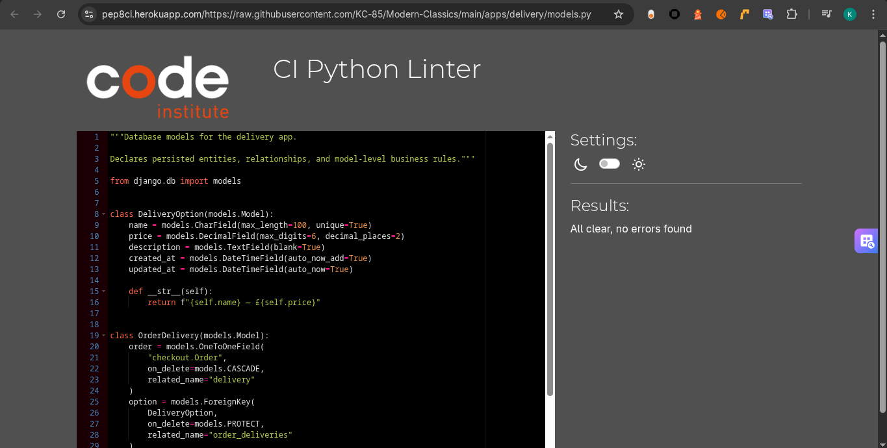 | Notes (if applicable) |
| apps | [urls.py](https://github.com/KC-85/Modern-Classics/blob/main/apps/delivery/urls.py) | [PEP8 CI Link](https://pep8ci.herokuapp.com/https://raw.githubusercontent.com/KC-85/Modern-Classics/main/apps/delivery/urls.py) | 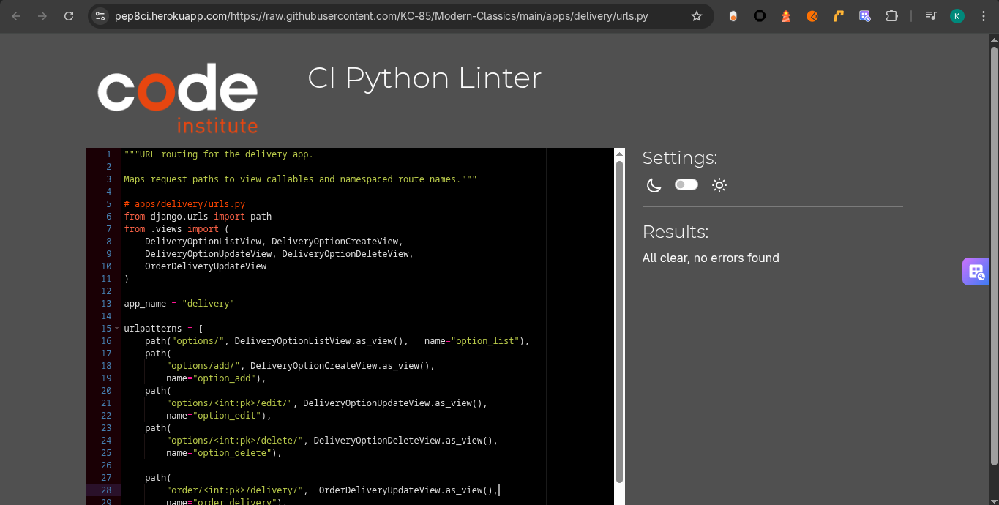 | Notes (if applicable) |
| apps | [views.py](https://github.com/KC-85/Modern-Classics/blob/main/apps/delivery/views.py) | [PEP8 CI Link](https://pep8ci.herokuapp.com/https://raw.githubusercontent.com/KC-85/Modern-Classics/main/apps/delivery/views.py) |  | Notes (if applicable) |
| core | [settings.py](https://github.com/KC-85/Modern-Classics/blob/main/core/settings.py) | [PEP8 CI Link](https://pep8ci.herokuapp.com/https://raw.githubusercontent.com/KC-85/Modern-Classics/main/core/settings.py) |  | Notes (if applicable) |
| core | [urls.py](https://github.com/KC-85/Modern-Classics/blob/main/core/urls.py) | [PEP8 CI Link](https://pep8ci.herokuapp.com/https://raw.githubusercontent.com/KC-85/Modern-Classics/main/core/urls.py) |  | Notes (if applicable) |
| core | [views.py](https://github.com/KC-85/Modern-Classics/blob/main/core/views.py) | [PEP8 CI Link](https://pep8ci.herokuapp.com/https://raw.githubusercontent.com/KC-85/Modern-Classics/main/core/views.py) |  | Notes (if applicable) |
|  | [manage.py](https://github.com/KC-85/Modern-Classics/blob/main/manage.py) | [PEP8 CI Link](https://pep8ci.herokuapp.com/https://raw.githubusercontent.com/KC-85/Modern-Classics/main/manage.py) |  | Notes (if applicable) |
| unit_tests | [test_admin.py](https://github.com/KC-85/Modern-Classics/blob/main/unit_tests/checkout/test_admin.py) | [PEP8 CI Link](https://pep8ci.herokuapp.com/https://raw.githubusercontent.com/KC-85/Modern-Classics/main/unit_tests/checkout/test_admin.py) |  | ⚠️ Notes (if applicable) |
| unit_tests | [test_apps.py](https://github.com/KC-85/Modern-Classics/blob/main/unit_tests/checkout/test_apps.py) | [PEP8 CI Link](https://pep8ci.herokuapp.com/https://raw.githubusercontent.com/KC-85/Modern-Classics/main/unit_tests/checkout/test_apps.py) |  | ⚠️ Notes (if applicable) |
| unit_tests | [test_forms.py](https://github.com/KC-85/Modern-Classics/blob/main/unit_tests/checkout/test_forms.py) | [PEP8 CI Link](https://pep8ci.herokuapp.com/https://raw.githubusercontent.com/KC-85/Modern-Classics/main/unit_tests/checkout/test_forms.py) |  | ⚠️ Notes (if applicable) |
| unit_tests | [test_models.py](https://github.com/KC-85/Modern-Classics/blob/main/unit_tests/checkout/test_models.py) | [PEP8 CI Link](https://pep8ci.herokuapp.com/https://raw.githubusercontent.com/KC-85/Modern-Classics/main/unit_tests/checkout/test_models.py) |  | ⚠️ Notes (if applicable) |
| unit_tests | [test_urls.py](https://github.com/KC-85/Modern-Classics/blob/main/unit_tests/checkout/test_urls.py) | [PEP8 CI Link](https://pep8ci.herokuapp.com/https://raw.githubusercontent.com/KC-85/Modern-Classics/main/unit_tests/checkout/test_urls.py) |  | ⚠️ Notes (if applicable) |
| unit_tests | [test_utils.py](https://github.com/KC-85/Modern-Classics/blob/main/unit_tests/checkout/test_utils.py) | [PEP8 CI Link](https://pep8ci.herokuapp.com/https://raw.githubusercontent.com/KC-85/Modern-Classics/main/unit_tests/checkout/test_utils.py) |  | ⚠️ Notes (if applicable) |
| unit_tests | [test_views.py](https://github.com/KC-85/Modern-Classics/blob/main/unit_tests/checkout/test_views.py) | [PEP8 CI Link](https://pep8ci.herokuapp.com/https://raw.githubusercontent.com/KC-85/Modern-Classics/main/unit_tests/checkout/test_views.py) |  | ⚠️ Notes (if applicable) |
| unit_tests | [test_webhook_handler.py](https://github.com/KC-85/Modern-Classics/blob/main/unit_tests/checkout/test_webhook_handler.py) | [PEP8 CI Link](https://pep8ci.herokuapp.com/https://raw.githubusercontent.com/KC-85/Modern-Classics/main/unit_tests/checkout/test_webhook_handler.py) |  | ⚠️ Notes (if applicable) |
| unit_tests | [test_webhooks.py](https://github.com/KC-85/Modern-Classics/blob/main/unit_tests/checkout/test_webhooks.py) | [PEP8 CI Link](https://pep8ci.herokuapp.com/https://raw.githubusercontent.com/KC-85/Modern-Classics/main/unit_tests/checkout/test_webhooks.py) |  | ⚠️ Notes (if applicable) |
| unit_tests | [test_admin.py](https://github.com/KC-85/Modern-Classics/blob/main/unit_tests/common/test_admin.py) | [PEP8 CI Link](https://pep8ci.herokuapp.com/https://raw.githubusercontent.com/KC-85/Modern-Classics/main/unit_tests/common/test_admin.py) |  | ⚠️ Notes (if applicable) |
| unit_tests | [test_apps.py](https://github.com/KC-85/Modern-Classics/blob/main/unit_tests/common/test_apps.py) | [PEP8 CI Link](https://pep8ci.herokuapp.com/https://raw.githubusercontent.com/KC-85/Modern-Classics/main/unit_tests/common/test_apps.py) |  | ⚠️ Notes (if applicable) |
| unit_tests | [test_forms.py](https://github.com/KC-85/Modern-Classics/blob/main/unit_tests/common/test_forms.py) | [PEP8 CI Link](https://pep8ci.herokuapp.com/https://raw.githubusercontent.com/KC-85/Modern-Classics/main/unit_tests/common/test_forms.py) |  | ⚠️ Notes (if applicable) |
| unit_tests | [test_models.py](https://github.com/KC-85/Modern-Classics/blob/main/unit_tests/common/test_models.py) | [PEP8 CI Link](https://pep8ci.herokuapp.com/https://raw.githubusercontent.com/KC-85/Modern-Classics/main/unit_tests/common/test_models.py) |  | ⚠️ Notes (if applicable) |
| unit_tests | [test_urls.py](https://github.com/KC-85/Modern-Classics/blob/main/unit_tests/common/test_urls.py) | [PEP8 CI Link](https://pep8ci.herokuapp.com/https://raw.githubusercontent.com/KC-85/Modern-Classics/main/unit_tests/common/test_urls.py) |  | ⚠️ Notes (if applicable) |
| unit_tests | [test_views.py](https://github.com/KC-85/Modern-Classics/blob/main/unit_tests/common/test_views.py) | [PEP8 CI Link](https://pep8ci.herokuapp.com/https://raw.githubusercontent.com/KC-85/Modern-Classics/main/unit_tests/common/test_views.py) |  | ⚠️ Notes (if applicable) |
| unit_tests | [test_admin.py](https://github.com/KC-85/Modern-Classics/blob/main/unit_tests/delivery/test_admin.py) | [PEP8 CI Link](https://pep8ci.herokuapp.com/https://raw.githubusercontent.com/KC-85/Modern-Classics/main/unit_tests/delivery/test_admin.py) |  | ⚠️ Notes (if applicable) |
| unit_tests | [test_apps.py](https://github.com/KC-85/Modern-Classics/blob/main/unit_tests/delivery/test_apps.py) | [PEP8 CI Link](https://pep8ci.herokuapp.com/https://raw.githubusercontent.com/KC-85/Modern-Classics/main/unit_tests/delivery/test_apps.py) |  | ⚠️ Notes (if applicable) |
| unit_tests | [test_forms.py](https://github.com/KC-85/Modern-Classics/blob/main/unit_tests/delivery/test_forms.py) | [PEP8 CI Link](https://pep8ci.herokuapp.com/https://raw.githubusercontent.com/KC-85/Modern-Classics/main/unit_tests/delivery/test_forms.py) |  | ⚠️ Notes (if applicable) |
| unit_tests | [test_models.py](https://github.com/KC-85/Modern-Classics/blob/main/unit_tests/delivery/test_models.py) | [PEP8 CI Link](https://pep8ci.herokuapp.com/https://raw.githubusercontent.com/KC-85/Modern-Classics/main/unit_tests/delivery/test_models.py) |  | ⚠️ Notes (if applicable) |
| unit_tests | [test_urls.py](https://github.com/KC-85/Modern-Classics/blob/main/unit_tests/delivery/test_urls.py) | [PEP8 CI Link](https://pep8ci.herokuapp.com/https://raw.githubusercontent.com/KC-85/Modern-Classics/main/unit_tests/delivery/test_urls.py) |  | ⚠️ Notes (if applicable) |
| unit_tests | [test_views.py](https://github.com/KC-85/Modern-Classics/blob/main/unit_tests/delivery/test_views.py) | [PEP8 CI Link](https://pep8ci.herokuapp.com/https://raw.githubusercontent.com/KC-85/Modern-Classics/main/unit_tests/delivery/test_views.py) |  | ⚠️ Notes (if applicable) |
| unit_tests | [helper.py](https://github.com/KC-85/Modern-Classics/blob/main/unit_tests/helper.py) | [PEP8 CI Link](https://pep8ci.herokuapp.com/https://raw.githubusercontent.com/KC-85/Modern-Classics/main/unit_tests/helper.py) |  | ⚠️ Notes (if applicable) |
| unit_tests | [test_admin.py](https://github.com/KC-85/Modern-Classics/blob/main/unit_tests/showroom/test_admin.py) | [PEP8 CI Link](https://pep8ci.herokuapp.com/https://raw.githubusercontent.com/KC-85/Modern-Classics/main/unit_tests/showroom/test_admin.py) |  | ⚠️ Notes (if applicable) |
| unit_tests | [test_apps.py](https://github.com/KC-85/Modern-Classics/blob/main/unit_tests/showroom/test_apps.py) | [PEP8 CI Link](https://pep8ci.herokuapp.com/https://raw.githubusercontent.com/KC-85/Modern-Classics/main/unit_tests/showroom/test_apps.py) |  | ⚠️ Notes (if applicable) |
| unit_tests | [test_forms.py](https://github.com/KC-85/Modern-Classics/blob/main/unit_tests/showroom/test_forms.py) | [PEP8 CI Link](https://pep8ci.herokuapp.com/https://raw.githubusercontent.com/KC-85/Modern-Classics/main/unit_tests/showroom/test_forms.py) |  | ⚠️ Notes (if applicable) |
| unit_tests | [test_models.py](https://github.com/KC-85/Modern-Classics/blob/main/unit_tests/showroom/test_models.py) | [PEP8 CI Link](https://pep8ci.herokuapp.com/https://raw.githubusercontent.com/KC-85/Modern-Classics/main/unit_tests/showroom/test_models.py) |  | ⚠️ Notes (if applicable) |
| unit_tests | [test_urls.py](https://github.com/KC-85/Modern-Classics/blob/main/unit_tests/showroom/test_urls.py) | [PEP8 CI Link](https://pep8ci.herokuapp.com/https://raw.githubusercontent.com/KC-85/Modern-Classics/main/unit_tests/showroom/test_urls.py) |  | ⚠️ Notes (if applicable) |
| unit_tests | [test_views.py](https://github.com/KC-85/Modern-Classics/blob/main/unit_tests/showroom/test_views.py) | [PEP8 CI Link](https://pep8ci.herokuapp.com/https://raw.githubusercontent.com/KC-85/Modern-Classics/main/unit_tests/showroom/test_views.py) |  | ⚠️ Notes (if applicable) |
| unit_tests | [test_admin.py](https://github.com/KC-85/Modern-Classics/blob/main/unit_tests/trailer/test_admin.py) | [PEP8 CI Link](https://pep8ci.herokuapp.com/https://raw.githubusercontent.com/KC-85/Modern-Classics/main/unit_tests/trailer/test_admin.py) |  | ⚠️ Notes (if applicable) |
| unit_tests | [test_apps.py](https://github.com/KC-85/Modern-Classics/blob/main/unit_tests/trailer/test_apps.py) | [PEP8 CI Link](https://pep8ci.herokuapp.com/https://raw.githubusercontent.com/KC-85/Modern-Classics/main/unit_tests/trailer/test_apps.py) |  | ⚠️ Notes (if applicable) |
| unit_tests | [test_forms.py](https://github.com/KC-85/Modern-Classics/blob/main/unit_tests/trailer/test_forms.py) | [PEP8 CI Link](https://pep8ci.herokuapp.com/https://raw.githubusercontent.com/KC-85/Modern-Classics/main/unit_tests/trailer/test_forms.py) |  | ⚠️ Notes (if applicable) |
| unit_tests | [test_models.py](https://github.com/KC-85/Modern-Classics/blob/main/unit_tests/trailer/test_models.py) | [PEP8 CI Link](https://pep8ci.herokuapp.com/https://raw.githubusercontent.com/KC-85/Modern-Classics/main/unit_tests/trailer/test_models.py) |  | ⚠️ Notes (if applicable) |
| unit_tests | [test_urls.py](https://github.com/KC-85/Modern-Classics/blob/main/unit_tests/trailer/test_urls.py) | [PEP8 CI Link](https://pep8ci.herokuapp.com/https://raw.githubusercontent.com/KC-85/Modern-Classics/main/unit_tests/trailer/test_urls.py) |  | ⚠️ Notes (if applicable) |
| unit_tests | [test_views.py](https://github.com/KC-85/Modern-Classics/blob/main/unit_tests/trailer/test_views.py) | [PEP8 CI Link](https://pep8ci.herokuapp.com/https://raw.githubusercontent.com/KC-85/Modern-Classics/main/unit_tests/trailer/test_views.py) |  | ⚠️ Notes (if applicable) |
| unit_tests | [test_admin.py](https://github.com/KC-85/Modern-Classics/blob/main/unit_tests/users/test_admin.py) | [PEP8 CI Link](https://pep8ci.herokuapp.com/https://raw.githubusercontent.com/KC-85/Modern-Classics/main/unit_tests/users/test_admin.py) |  | ⚠️ Notes (if applicable) |
| unit_tests | [test_apps.py](https://github.com/KC-85/Modern-Classics/blob/main/unit_tests/users/test_apps.py) | [PEP8 CI Link](https://pep8ci.herokuapp.com/https://raw.githubusercontent.com/KC-85/Modern-Classics/main/unit_tests/users/test_apps.py) |  | ⚠️ Notes (if applicable) |
| unit_tests | [test_forms.py](https://github.com/KC-85/Modern-Classics/blob/main/unit_tests/users/test_forms.py) | [PEP8 CI Link](https://pep8ci.herokuapp.com/https://raw.githubusercontent.com/KC-85/Modern-Classics/main/unit_tests/users/test_forms.py) |  | ⚠️ Notes (if applicable) |
| unit_tests | [test_models.py](https://github.com/KC-85/Modern-Classics/blob/main/unit_tests/users/test_models.py) | [PEP8 CI Link](https://pep8ci.herokuapp.com/https://raw.githubusercontent.com/KC-85/Modern-Classics/main/unit_tests/users/test_models.py) |  | ⚠️ Notes (if applicable) |
| unit_tests | [test_urls.py](https://github.com/KC-85/Modern-Classics/blob/main/unit_tests/users/test_urls.py) | [PEP8 CI Link](https://pep8ci.herokuapp.com/https://raw.githubusercontent.com/KC-85/Modern-Classics/main/unit_tests/users/test_urls.py) |  | ⚠️ Notes (if applicable) |
| unit_tests | [test_views.py](https://github.com/KC-85/Modern-Classics/blob/main/unit_tests/users/test_views.py) | [PEP8 CI Link](https://pep8ci.herokuapp.com/https://raw.githubusercontent.com/KC-85/Modern-Classics/main/unit_tests/users/test_views.py) |  | ⚠️ Notes (if applicable) |


## Responsiveness

I've tested my deployed project to check for responsiveness issues.

| Page | Mobile | Tablet | Desktop | Notes |
| --- | --- | --- | --- | --- |
| Hero |  |  |  | Works as expected |
| Register |  |  |  | Works as expected |
| Login |  |  |  | Works as expected |
| Profile |  |  |  | Works as expected |
| Showroom |  |  |  | Works as expected |
| Car Details |  |  |  | Works as expected |
| Cart |  |  |  | Works as expected |
| Checkout |  |  |  | Works as expected |
| Checkout Success |  |  |  | Works as expected |
| Add Car |  |  |  | Works as expected |
| Edit Car |  |  |  | Works as expected |
| Newsletter |  |  |  | Works as expected |
| Contact |  |  |  | Works as expected |
| 404 |  |  |  | Works as expected |

## Browser Compatibility

I've tested my deployed project on multiple browsers to check for compatibility issues.

| Page | Chrome | Firefox | Safari | Notes |
| --- | --- | --- | --- | --- |
| Register |  |  |  | Works as expected |
| Login |  |  |  | Works as expected |
| Profile |  |  |  | Works as expected |
| Showroom |  |  |  | Works as expected |
| Car Details |  |  |  | Works as expected |
| Cart |  |  |  | Works as expected |
| Checkout |  |  |  | Works as expected |
| Checkout Success |  |  |  | Works as expected |
| Add car |  |  |  | Works as expected |
| Edit Car |  |  |  | Works as expected |
| Newsletter |  |  |  | Works as expected |
| Contact |  |  |  | Works as expected |
| 404 |  |  |  | Works as expected |

## Lighthouse Audit

I've tested my deployed project using the Lighthouse Audit tool to check for any major issues. Some warnings are outside of my control, and mobile results tend to be lower than desktop.

| Page | Mobile | Desktop |
| --- | --- | --- |
| Register |  |  |
| Login |  |  |
| Profile |  |  |
| Showroom |  |  |
| Car Detail |  |  |
| Cart |  |  |
| Checkout |  |  |
| Checkout Success |  |  |
| Add Car |  |  |
| Edit Car |  |  |
| Newsletter |  |  |
| Contact |  |  |
| 404 |  |  |

## Defensive Programming

Defensive programming was manually tested with the below user acceptance testing:

| Page | Expectation | Test | Result | Screenshot |
| --- | --- | --- | --- | --- |
| Cars | Feature is expected to allow users to browse products without registration. | Opened product pages as a guest user. | Products were fully accessible without requiring registration. |  |
| Sorting| Feature is expected to sort products by price . | Tested sorting options for price (low-to-high/high-to-low). | Sorting worked correctly for all options. |  |
| Filtering | Feature is expected to filter products by category. | Applied category filters while browsing products. | Filters worked as expected, displaying only relevant products. |  |
| Product Details | Feature is expected to show detailed product information. | Clicked on individual products to view details. | Product details (description, price, image) were displayed correctly. |  |
| Add to Cart | Feature is expected to allow customers to add items to the cart with quantity controls. | Added products to the cart and adjusted quantities. | Items were added successfully, and quantities updated as expected. |  |
| Manage Cart | Feature is expected to allow customers to view and manage their cart. | Opened the cart page and edited cart contents. | Cart contents were displayed, updated, and removed correctly. |  |
| Checkout | Feature is expected to display cart items, grand total, and input fields for checkout. | Proceeded to checkout with items in the cart. | Checkout page displayed cart items, total, and input fields as expected. |  |
| Stripe Payment| Feature is expected to allow secure payment via Stripe. | Entered valid card details using Stripe at checkout. | Payment was processed securely, and an order confirmation page was displayed. |  |
| | Feature is expected to send a confirmation email after purchase. | Completed a purchase and checked email inbox. | Confirmation email was received with order details. |  |
| Order Confirmation | Feature is expected to display an order confirmation page with an order number. | Completed a purchase. | Order confirmation page displayed successfully with an order number. |  |
| Account Management | Feature is expected to allow returning customers to log in and view past orders. | Logged in as a returning customer and accessed order history. | Past orders were displayed correctly in the account section. |  |
| Saved Address | Feature is expected to remember the shipping address for returning customers. | Completed multiple checkouts as a returning customer. | Shipping address was pre-filled on subsequent purchases. |  |
| Admin Features | Feature is expected to allow the site owner to create new products. | Created new products with valid data (name, price, description, image, category). | Products were added successfully and displayed on the site. |  |
| Admin Features | Feature is expected to allow the site owner to update product details. | Edited product details as an admin user. | Product updates were saved and displayed correctly. |  |
| Admin Features | Feature is expected to allow the site owner to delete products. | Deleted a product from the inventory. | Product was removed successfully from the site, after being prompted to confirm first. |  |
| Orders | Feature is expected to allow the site owner to view all orders placed. | Accessed the orders dashboard as an admin user. | All orders were displayed correctly. |  |
| Newsletter | Feature is expected to allow users to sign up for the newsletter. | Submitted valid email addresses for newsletter registration. | Email addresses were successfully added to the newsletter list. |  |
| 404 Error Page | Feature is expected to display a 404 error page for non-existent pages. | Navigated to an invalid URL (e.g., `/test`). | A custom 404 error page was displayed as expected. |  |

## User Story Testing

| Target | Expectation | Outcome | Screenshot |
| --- | --- | --- | --- |
| As a guest user | I would like to browse products without needing to register | so that I can browse freely before deciding to create an account. |  |
| As a guest user | I would like to be prompted to create an account or log in at add to cart | so that I can complete my purchase and track my order history. |  |
| As a user | I would like to sign up to the site's newsletter | so that I can stay up to date with any upcoming sales or promotions. |  |
| As a customer | I would like to browse various product categories (make, model etc.) | so that I can easily find what I'm looking for. |  |
| As a customer | I would like to sort products by price (low-to-high/high-to-low/newest) | so that I can quickly organize items in a way that suits my shopping style. |  |
| As a customer | I would like to click on individual products to view more details (description, price, image, etc.) | so that I can make an informed decision about my purchase. |  |
| As a customer | I would like to view and manage my shopping cart | so that I can review, add, or remove items before proceeding to checkout. |  |
| As a customer | I would like to adjust the quantity of items in my cart | so that I can modify my purchase preferences without leaving the cart. |  |
| As a customer | I would like to remove items from my cart | so that I can remove products I no longer wish to buy. |  |
| As a customer | I would like to proceed to checkout where I see my cart items, grand total, and input my name, email, shipping address, and card details | so that I can complete my purchase. |  |
| As a customer | I would like to receive a confirmation email after my purchase | so that I can have a record of my transaction and order details. |  |
| As a customer | I would like to see an order confirmation page with a checkout order number after completing my purchase | so that I know my order has been successfully placed. |  |
| As a customer | I would like to securely enter my card details using Stripe at checkout | so that I can feel confident my payment information is protected. |  |
| As a returning customer | I would like to be able to log in and view my past orders | so that I can track my previous purchases and order history. |  |
| As a returning customer | I would like the checkout process to remember my shipping address | so that future purchases are quicker and easier. |  |
| As a site owner | I would like to create new products with a name, description, price, images, and category | so that I can add additional items to the store inventory. |  |
| As a site owner | I would like to update product details (name, price, description, image, category) at any time | so that I can keep my product listings accurate and up to date. |  |
| As a site owner | I would like to delete products that are no longer available or relevant | so that I can maintain a clean and accurate inventory. |  |
| As a site owner | I would like to view all orders placed on the website | so that I can track and manage customer purchases. |  |
| As a site owner | I would like to manage product categories | so that I can ensure items are correctly organized and easy for customers to find. |  |
| As a user | I would like to see a 404 error page if I get lost | so that it's obvious that I've stumbled upon a page that doesn't exist. |  |

## Automated Testing

I have conducted a series of automated tests on my application.

> [!NOTE]
> I fully acknowledge and understand that, in a real-world scenario, an extensive set of additional tests would be more comprehensive.

### Python (Unit Testing)

I used Django's built-in test runner and the app-level unit test suites in [unit_tests](unit_tests/).

Primary command used during this assessment phase:

- `python3 manage.py test`

Current result:

- Full suite passes locally (`Exit Code: 0`) after Tier 1 to Tier 4 fixes.
- Key regressions were added around checkout payment status transitions, webhook idempotency, delivery-option access control, and navigation discoverability.

Coverage reporting commands used:

- `coverage run --omit=*/site-packages/*,*/migrations/*,*/__init__.py,manage.py -m django test`
- `coverage report`
- `coverage html`

Below are the latest coverage artifacts:


#### Unit Test Issues

- Initial environment issue: virtual environment created with Python 3.14 caused dependency install failures (notably psycopg2 wheel/build path).
- Resolution: recreated virtual environment with Python 3.12 (matching [.python-version](.python-version)), reinstalled requirements, reran suite successfully.
- One test expectation update was required after payment and access-control hardening: denial responses can be `302` or `403` depending on decorator/redirect behavior.

## Bugs

Bug tracking is managed through [GitHub Issues](https://www.github.com/KC-85/Modern-Classics/issues) using labels and close-state history for reproducible audit trails.

### Fixed Bugs

[](https://www.github.com/KC-85/Modern-Classics/issues?q=is%3Aissue+is%3Aclosed+label%3Abug)

I've used [GitHub Issues](https://www.github.com/KC-85/Modern-Classics/issues) to track and manage bugs and issues during the development stages of my project.

All previously closed/fixed bugs can be tracked [here](https://www.github.com/KC-85/Modern-Classics/issues?q=is%3Aissue+is%3Aclosed+label%3Abug).


### Unfixed Bugs

[](https://www.github.com/KC-85/Modern-Classics/issues)

Any remaining open issues can be tracked [here](https://www.github.com/KC-85/Modern-Classics/issues).


### Known Issues

| Issue | Screenshot |
| --- | --- |
| On devices smaller than 375px, the page starts to have horizontal `overflow-x` scrolling. |  |
| When validating HTML with a semantic `<section>` element, the validator warns about lacking a header `h2-h6`. This is acceptable. |  |
| Validation errors on "signup.html" coming from the Django Allauth package. |  |
| With a known order-number, users can brute-force "checkout_success.html" and see potentially sensitive information. |  |
| If a product is in your bag/cart, but then gets deleted from the database, it throws errors from the session storage memory. |  |


> [!IMPORTANT]
> There are no remaining bugs that I am aware of, though, even after thorough testing, I cannot rule out the possibility.

